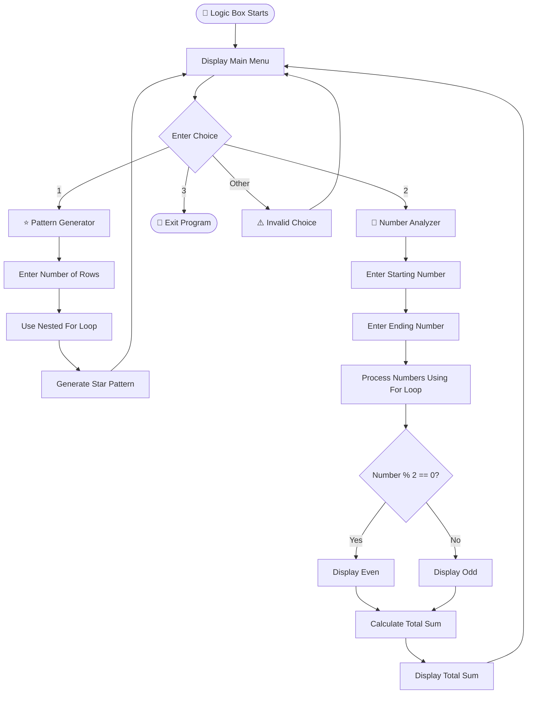

<div align="center">

🧠 Logic Box

Pattern Generator & Number Analyzer

> **Think. Code. Analyze. Repeat.** 🐍💻

A beginner-friendly, menu-driven Python project created to practice core
programming concepts through pattern generation and number analysis.

Python
Project
Level
Status

</div>

────────

📌 Project Overview

Logic Box is an interactive Python console application designed to
strengthen basic programming logic.

The project combines loops, conditional statements, user input,
type casting, mathematical operations, and menu-driven programming
into one simple application.

⭐ Main Features

• ⭐ Pattern Generator — Generates a star pattern based on the number of rows.
• 🔢 Number Analyzer — Checks numbers in a range as Even or Odd and calculates their total sum.
• 🔄 Interactive Menu — Allows multiple operations without restarting the program.

────────

✨ Features

|🎯 Feature              |📝 Description                                    |🧠 Main Concept       |
|:----------------------|:------------------------------------------------|:--------------------|
|⭐ **Pattern Generator**|Generates a star pattern using the number of rows|Nested `for` loop    |
|🔢 **Number Analyzer**  |Identifies numbers as Even or Odd                |`if-else`, `%`       |
|➕ **Total Sum**        |Calculates the sum of numbers in a range         |Variables, `for` loop|
|🔄 **Interactive Menu** |Repeats operations until Exit is selected        |`while` loop         |
|⌨️ **User Input**       |Takes values directly from the user              |`input()`            |
|🔢 **Type Casting**     |Converts input values into integers              |`int()`              |

────────

⭐ 1. Pattern Generator

The user enters the required number of rows, and the program generates a
star pattern using nested for loops.

Example

```text
Enter number of rows: 5

*
**
***
****
*****
```

────────

🔢 2. Number Analyzer

The user enters a starting and ending number.

The program checks every number, identifies whether it is Even or Odd,
and calculates the total sum.

Example

```text
Enter starting number: 1
Enter ending number: 5

1 → Odd
2 → Even
3 → Odd
4 → Even
5 → Odd

Total Sum = 15
```

────────

🔄 3. Interactive Menu

The program continuously displays the menu until the user selects Exit.

```text
1. Generate a pattern
2. Analyze a range of numbers
3. Exit
```

────────

🧠 Python Concepts Used

|🐍 Concept        |🎯 Purpose                              |
|:----------------|:--------------------------------------|
|`while` loop     |Keeps the menu running continuously    |
|`for` loop       |Processes rows and numbers             |
|Nested `for` loop|Generates the star pattern             |
|`if-elif-else`   |Makes decisions based on conditions    |
|`input()`        |Takes input from the user              |
|`int()`          |Converts user input into integers      |
|`range()`        |Generates a sequence of numbers        |
|`%` operator     |Checks whether a number is Even or Odd |
|`break`          |Stops the program when Exit is selected|
|Variables        |Stores input and calculated values     |

────────

🔄 Program Flow



────────

🧩 Logic Behind the Project

⭐ Pattern Logic

The nested loop controls the number of rows and stars printed on each row.

```text
Rows = 5

Row 1 → *
Row 2 → **
Row 3 → ***
Row 4 → ****
Row 5 → *****
```

🔢 Even / Odd Logic

The modulo % operator checks divisibility by 2.

```text
If number % 2 == 0
        ↓
      Even

Otherwise
        ↓
       Odd
```

➕ Sum Logic

Each number in the selected range is added to a running total.

```text
1 + 2 + 3 + 4 + 5 = 15
```

────────

💻 Sample Output

⭐ Pattern Generator

```text
===== LOGIC BOX =====

1. Generate a pattern
2. Analyze a range of numbers
3. Exit

Enter your choice: 1

Enter number of rows: 5

*
**
***
****
*****
```

🔢 Number Analyzer

```text
===== LOGIC BOX =====

1. Generate a pattern
2. Analyze a range of numbers
3. Exit

Enter your choice: 2

Enter starting number: 1
Enter ending number: 5

1 → Odd
2 → Even
3 → Odd
4 → Even
5 → Odd

Total Sum = 15
```

────────

📸 Output

<div align="center">

🖥️ Program Output Screenshot


</div>

────────

🎥 Demo Video

<div align="center">

▶️ Watch the Complete Project Demonstration


(https://github.com/user-attachments/assets/e5d8a21a-e7b2-4972-b22f-818160fc5cfb)


Click the button above to watch the complete demonstration of Logic Box.

</div>

────────

🎯 Project Objective

The main objective of Logic Box is to understand how basic Python
programming concepts can be combined to build an interactive application.

This project focuses on:

• 🧠 Programming logic
• 🔄 Looping skills
• 🔀 Conditional decision-making
• ⌨️ User input handling
• ➕ Basic mathematical operations
• 🧩 Menu-driven program structure
• 🐍 Python programming fundamentals

────────

🛠️ Technologies Used

|🧰 Technology            |📌 Usage                       |
|:-----------------------|:-----------------------------|
|🐍 **Python 3**          |Main programming language     |
|💻 **Python IDLE / IDE** |Code development and execution|
|📦 **External Libraries**|Not required                  |

────────

▶️ How to Run

📋 Prerequisites

Make sure Python 3 is installed.

```bash
python --version
```

🚀 Run the Program

```bash
python py2.py
```

Steps

1. Install Python 3.
2. Download or clone this repository.
3. Open py2.py.
4. Run the program.
5. Select an option from the menu.
6. Enter the required values.
7. Select 3 to exit.

────────

📁 Project Structure

```text
Logic-Box/
│
├── 🐍 py2.py
├── 📖 README.md
└── 📁 assets/
    └── 🖥️ output.png
```

────────

📈 Future Improvements

• ⭐ More pattern types
• 🔢 Prime number checking
• 🔄 Palindrome number checking
• ✖️ Factorial calculation
• 📊 Multiplication tables
• ✅ Better input validation
• 🖥️ Graphical User Interface (GUI)
• 📈 More mathematical analysis features

────────

🎓 Learning Outcomes

Through this project, I learned how to:

✅ Use loops to repeat tasks

✅ Use nested loops to generate patterns

✅ Apply conditions for decision-making

✅ Take and process user input

✅ Use mathematical operators

✅ Build a menu-driven Python application

✅ Improve programming logic and problem-solving skills

────────

👩‍💻 Project Details

<div align="center">

|📌 Detail         |📝 Information                       |
|:----------------|:-----------------------------------|
|**Project Name** |Logic Box                           |
|**Project Type** |Python Mini Project                 |
|**Language**     |Python                              |
|**Level**        |Beginner                            |
|**Main Features**|Pattern Generation & Number Analysis|

</div>

────────

🌟 Key Learning

<div align="center">

> **“Small programs build strong programming logic.”** 💡

</div>

Logic Box demonstrates how simple Python concepts such as loops,
conditions, variables, user input, and operators can work together
to create a useful and interactive application.

────────

🤝 Contributing

Contributions and suggestions are welcome! 🎉

1. 🍴 Fork the repository
2. 🌿 Create a new branch
3. 💻 Make your changes
4. 💾 Commit your changes
5. 📤 Push the branch
6. 🔃 Open a Pull Request

────────

⭐ Support

<div align="center">

If you found this project helpful for learning Python,
please consider giving the repository a ⭐ star!

💙 Thank You for Visiting!

Made with ❤️ using 🐍 Python

```text
╔═══════════════════════════════════════════════════════╗
║                                                       ║
║       🧠 Think. Code. Analyze. Repeat. 🐍💻          ║
║                                                       ║
╚═══════════════════════════════════════════════════════╝
```


